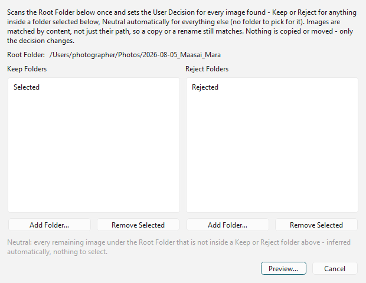
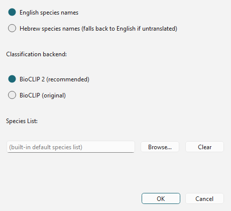
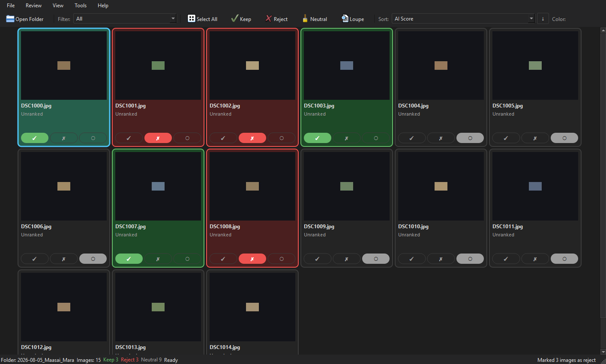
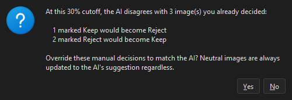
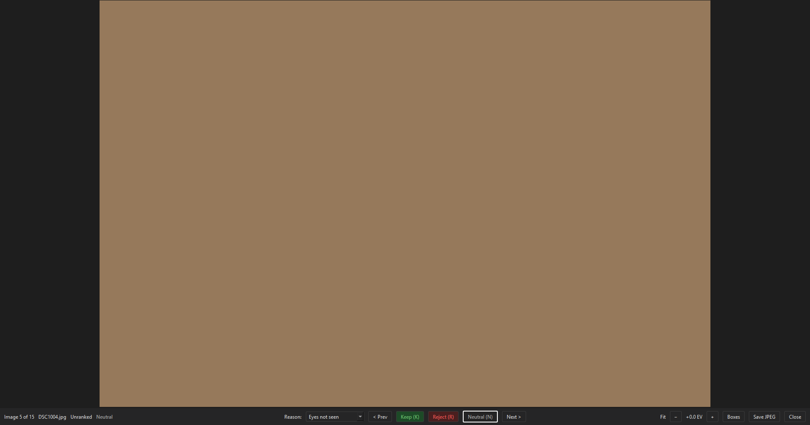
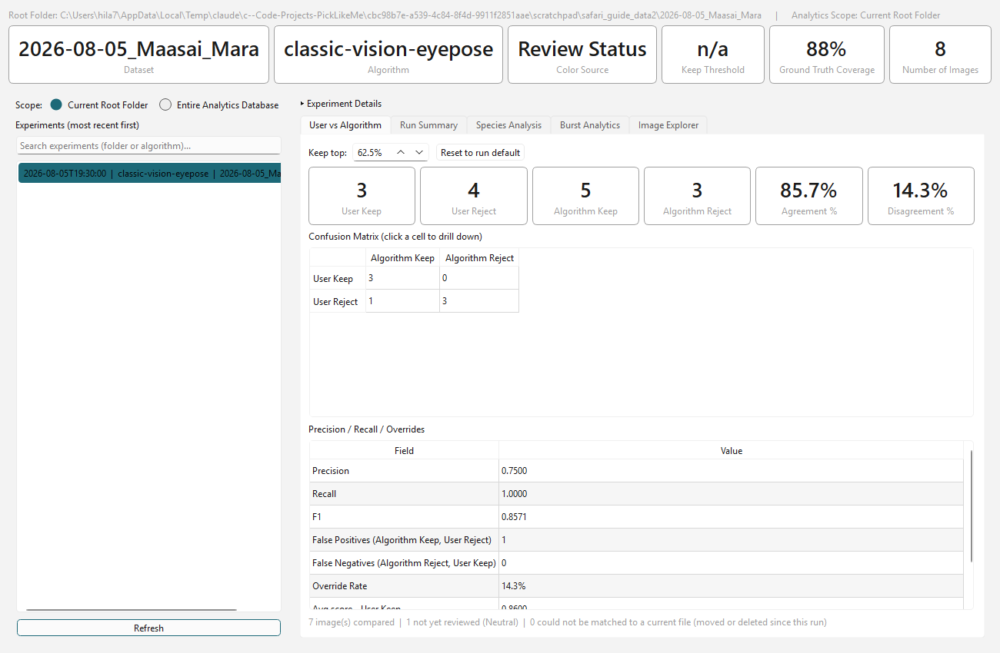
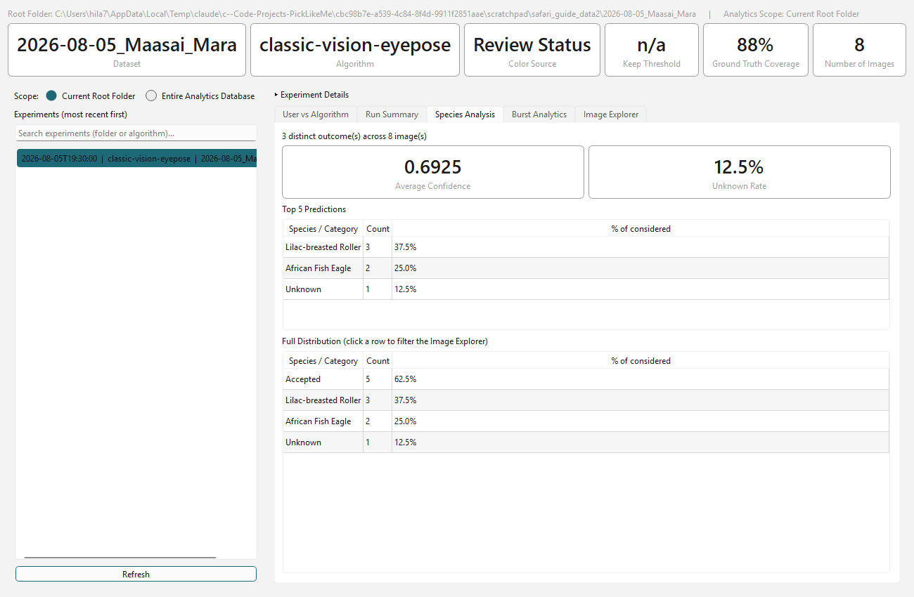
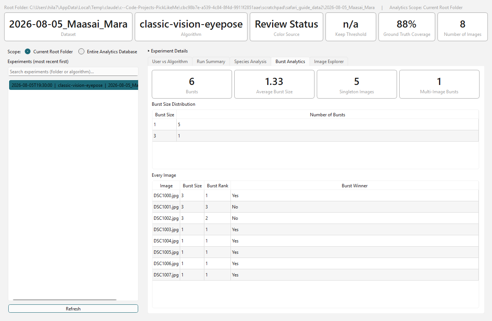

# PeakPic Safari Operational Guide (Mac)

**This guide is for using PeakPic in the field — not for installing it, not
for developing it.** It assumes PeakPic is already installed and working on
your MacBook (see `docs/Developer_Onboarding_Mac.md` if it isn't yet — that
is a separate, one-time setup document you should not need again while
travelling).

No Visual Studio Code. No Claude Code. No Git. No programming. Just the
application, and how to move through a big day's take quickly and safely.

Keep this guide on your MacBook (it's part of the project folder) or print
Section 11 and keep it with your gear.

---

## Table of Contents

1. [Preparing the MacBook Before Departure](#1-preparing-the-macbook-before-departure)
2. [Recommended Folder Structure](#2-recommended-folder-structure)
3. [Daily Workflow](#3-daily-workflow)
4. [Using the Main Review Window](#4-using-the-main-review-window)
5. [Using Loupe](#5-using-loupe)
6. [Using the Analytics Dashboard](#6-using-the-analytics-dashboard)
7. [Performance Recommendations](#7-performance-recommendations)
8. [Backup Strategy](#8-backup-strategy)
9. [Troubleshooting](#9-troubleshooting)
10. [Offline Operation](#10-offline-operation)
11. [Quick Daily Checklist](#11-quick-daily-checklist)

---

## 1. Preparing the MacBook Before Departure

Do this checklist **at home, on your own internet connection**, at least a
day or two before you leave — every item that needs a download needs to
succeed once before you're relying on it in a tent with no signal.

### ☐ 1.1 — PeakPic launches successfully

Open a Terminal window, then run:

```bash
cd ~/Code/PickLikeMe          # or wherever you installed it
source .venv/bin/activate
python -m picklikeme.desktop
```

Or double-click **Start PeakPic.command** in the project folder (the first
time, right-click it and choose **Open** instead of double-clicking, so
macOS lets it run — see Section 9 if it refuses).

**Pass/fail:** the PeakPic window opens within a few seconds, with a menu
bar (File, Review, View, Tools, Help) and an empty gallery. No error
windows.

### ☐ 1.2 — AI models are already downloaded

Every ranking/species feature needs a model file the first time it's used,
and that first time needs the internet (Section 10 covers exactly which
features these are). Do all of the following **once, at home**, so nothing
tries to download anything for the first time on safari:

1. Open any test folder of a few photos (even snapshots from your Photos
   library exported to a folder work fine for this check).
2. **Tools → Rank → Classic Vision Ranking (EyePose-v0, recommended)…** —
   run it once. This is the recommended day-to-day ranking method.
3. **Tools → Rank → AI Model…** — run it once, if you use the trained
   preference model.
4. **Tools → Organize by Species…** — open the dialog, click OK once (on a
   small test folder), let it finish. This downloads the species
   classifier the first time.

Each of these will show visible progress the first time (a download, then
a short pause) and finish quickly on every run after that. If any of them
finishes **instantly** with no pause at all, either it was already
downloaded from an earlier session, or something is wrong (see Section 9).

### ☐ 1.3 — No internet connection is required (day to day)

Turn on Airplane Mode (or just disconnect Wi-Fi), then repeat 1.2's four
checks on the same test folder. Everything should work identically —
ranking, species organization, review, the Loupe, the Analytics Dashboard.
If anything fails only with the internet off, note exactly what failed and
fix it before you go (Section 10 lists exactly what does and doesn't need
a connection).

### ☐ 1.4 — Required caches already exist

In Terminal, from the project folder:

```bash
ls -la cache/eye_models/
ls -la ~/.cache/huggingface/hub/ 2>/dev/null
```

You should see `eye_pose_v0.onnx` (and/or `superanimal_bird_resnet_50.pt`)
in the first listing, and one or more `models--imageomics--...` folders in
the second, once you've done 1.2. If either is empty, repeat 1.2.

### ☐ 1.5 — Species list is available

**Tools → Organize by Species…** — the **Species List** field should read
**"(built-in default species list)"**. That's the built-in list this
project ships with — you don't need to provide your own unless you want
to restrict classification to a specific set of species (e.g. only your
destination's local wildlife). If you do want a custom list, prepare it
now (a plain text file, one species name per line) and pick it via
**Browse…** — the dialog will immediately tell you how many species it
loaded, so you'll know right away if the file is valid.

### ☐ 1.6 — Ranking works correctly

On your test folder: **Tools → Rank → Classic Vision Ranking
(EyePose-v0, recommended)…**, click through, wait for it to finish. The
gallery should now show a score/rank for each image and the status bar
should report how many images were considered/accepted. If every image
shows "Unranked", something went wrong — see Section 9.

### ☐ 1.7 — Loupe works

Double-click any image in the gallery (or select it and press
**Return**). The Loupe should open full-screen, showing the image with a
control bar at the bottom (Keep/Reject/Neutral, Prev/Next, zoom, exposure,
Boxes, Save JPEG, Close). Press the **Right arrow** a few times to
navigate, then **Escape** to close.

### ☐ 1.8 — Analytics Dashboard works

**Tools → Analytics Dashboard…**. Pick your test experiment from the list
on the left. Click through the **User vs Algorithm**, **Run Summary**,
**Species Analysis**, and **Burst Analytics** tabs — each should show
real numbers, not blank panels or error text.

### ☐ 1.9 — Organize by Species works

Already covered by 1.2/1.5 above — confirm the test folder actually grew
species-named subfolders after the run (Finder → your test folder).

### ☐ 1.10 — Ground Truth tools work

**Tools → Set User Decisions by Subfolders…**. The dialog should open
showing your test folder as the Root Folder, with empty Keep Folders and
Reject Folders lists. Click **Add Folder…** under Keep Folders and pick
any subfolder to confirm the picker works, then **Remove Selected** to
undo it, then **Cancel** — you don't need to actually run this against
your test folder, just confirm the dialog opens and its buttons respond.



This tool is for a specific situation: you already manually sorted photos
outside PeakPic (e.g. dragged files into "Selected"/"Portfolio" folders in
Finder) and want PeakPic to know those decisions without re-clicking
through every image. It matches images by their actual content, so even a
renamed or copied file is still recognized — and it never moves or copies
any files itself, it only records the Keep/Reject/Neutral decision.

### ☐ 1.11 — Batteries, cards, and physical prep

- Charge the MacBook to 100% and pack its charger (and a car/travel
  adapter if relevant).
- Format or clear enough memory cards for the trip, and pack a card
  reader (built-in SD slots aren't on every MacBook).
- If you're bringing an external SSD for backups (strongly recommended —
  see Section 8), confirm it mounts on this Mac and has enough free space
  for the whole trip's expected shot count.

---

## 2. Recommended Folder Structure

```
Trip Root/                              e.g. "2026 Kenya Safari"
├── 2026-08-05 Maasai Mara AM/          one folder per outing/card
│   ├── DSC1000.NEF                     ← RAW files land here first
│   ├── DSC1001.NEF
│   ├── ...
│   ├── .picklikeme/                    ← PeakPic creates this automatically
│   │   ├── ranking-classic-vision-eyepose-v0.csv
│   │   └── classic-vision-eyepose-v0_filters.json
│   ├── _Selected/                      ← created by Tools → Organize
│   │   ├── Lilac-breasted Roller/      ← created by Organize by Species,
│   │   ├── African Fish Eagle/            if you run it on _Selected
│   │   └── Unknown/
│   └── _Rejected/                      ← created by Tools → Organize
├── 2026-08-05 Maasai Mara PM/
├── 2026-08-06 Serengeti Crossing/
└── ...
```

**Why one folder per outing/card, not one giant folder for the whole
trip:**

- **Ranking is per-folder.** PeakPic scores whatever folder you open, as
  its own batch. A folder of 40,000 photos from three weeks ranked
  together tells you "best of the trip", which isn't what you want every
  evening — you want "best of *today*". Rank each day's folder
  separately and you get a fresh, meaningful top-to-bottom ordering every
  single evening.
- **Smaller folders review faster.** A few hundred images per folder is
  comfortable to review end-to-end in one sitting; a folder with
  thousands makes it easy to lose your place.
- **`.picklikeme/`, `_Selected/`, and `_Rejected/` are created
  automatically, right inside the folder you open** — you never create
  these yourself. Don't rename or move them by hand while PeakPic has that
  folder open.
- **Species subfolders go inside whichever folder is currently open when
  you run Organize by Species.** If you run it directly on your day
  folder, it will sort *everything* — keepers and rejects alike — into
  species subfolders. The recommended order (see Section 3) is: rank →
  review (Keep/Reject) → **Organize** (splits into `_Selected`/
  `_Rejected`) → open `_Selected` → **Organize by Species** on that,
  so only your keepers get sorted by species and your rejects stay
  untouched in `_Rejected`.
- **One folder per card also matches how you'll copy files off a memory
  card** — see Section 3's first step — so there's no manual sorting
  needed between "what came off which card" and "what folder PeakPic
  should open".

If you shoot two cards in one outing, either keep them as two separate
day-folders (`... AM Card1/`, `... AM Card2/`) or merge them into one
folder before ranking, whichever matches how you actually think about
that outing. PeakPic doesn't care which — it only cares about whatever
folder you tell it to open.

---

## 3. Daily Workflow

The recommended end-of-day routine, in order:

### 1. Copy photographs from the memory card

Copy the card's contents into today's new folder (Section 2's structure).
Use Finder (drag the card's DCIM folder's contents into your new day
folder) or your preferred RAW-import tool — PeakPic doesn't do the copy
step itself, it works on whatever folder already has files in it.

### 2. Create a backup

**Before you touch anything else**, copy that same folder to your
external SSD. See Section 8 for the full backup strategy and why this
step comes this early (before ranking, before any Keep/Reject decision).

### 3. Open PeakPic

Launch it (Section 1.1's command, or **Start PeakPic.command**).

### 4. Open today's folder

**File → Open Folder…** (or <kbd>Cmd</kbd>+<kbd>O</kbd>), navigate to
today's folder, select it. PeakPic remembers the last folder you opened
this way and starts there next time, and keeps a **File → Recent
Folders** list of the last 5 — handy on day 2 onward when you're always
picking a sibling of yesterday's folder.

### 5. Run Ranking

**Tools → Rank → Classic Vision Ranking (EyePose-v0, recommended)…**
(or click the small arrow on the toolbar's **Rank** button and pick it
from the dropdown there — the same list as the Tools menu). This scores
every image by eye sharpness, subject sharpness, and subject size — no
internet needed (Section 10), and fast enough to run on every folder
every evening as a matter of habit.

> Note: clicking the main part of the toolbar's **Rank** button (not its
> dropdown arrow) always runs the **AI Model** strategy specifically,
> regardless of which method you used last — it is not a "repeat my last
> choice" shortcut. If EyePose-v0 is your everyday method, use the Tools
> menu or the dropdown arrow, not a bare click on the button itself.

### 6. Review using the Main Review Window

Work through the grid — see Section 4 for exactly how to do this quickly
across a large take. Sort by score (the default), mark obvious rejects
fast, and don't agonize over every single frame in the grid view — that's
what step 7 is for.

### 7. Use Loupe for difficult images

For anything genuinely close — a burst where two or three frames all look
promising, a shot where you need to check focus on the eye — open it
full-screen in the Loupe (double-click, or select and press
<kbd>Return</kbd>) rather than squinting at the thumbnail. See Section 5.

### 8. Mark Keep / Reject

Press <kbd>K</kbd> / <kbd>R</kbd> as you go (in the grid or in the
Loupe) — see Section 4's keyboard-shortcut table. Leave anything you're
genuinely unsure about as **Neutral** (the default, unmarked state) rather
than forcing a decision — you can always revisit it, and Neutral is the
one status that never gets touched by **Organize**.

### 9. Run Organize (and Organize by Species, if desired)

**Tools → Organize…** moves your Keep-marked images into `_Selected/` and
Reject-marked images into `_Rejected/`, leaving Neutral images exactly
where they are. It shows you the exact counts and destination folders
before moving anything — read that dialog before confirming.

If you want your keepers sorted by species, **open `_Selected`** as a new
folder in PeakPic (**File → Open Folder…**) and run **Tools → Organize by
Species…** on it — see Section 2's note on why this order matters.



### 10. Close the application

Just close the window (<kbd>Cmd</kbd>+<kbd>Q</kbd>, or the red close
button). Everything — your Keep/Reject decisions, your rankings, your
species folders — is already saved to disk as you went; there's no
separate "save" step and nothing is lost by closing.

---

## 4. Using the Main Review Window



The main window is a grid of thumbnail cards. Each card shows the
filename, its current status (Keep/Reject/Neutral, or "Unranked" before
you've run Ranking), and three small buttons (✓ Keep / ✗ Reject / ○
Neutral) you can click directly on the card without opening anything
else. A Keep card gets a green tint and border; a Reject card gets a red
tint and border; Neutral stays plain — so a glance across the whole grid
tells you where you stand.

### Sorting

The **Sort:** dropdown in the toolbar controls grid order:

| Option | What it sorts by |
| --- | --- |
| **AI Score** | The default — whichever ranking you last ran, best first |
| **{Strategy} Score** | One entry per ranking method you've run (e.g. "Classic Vision Ranking (EyePose-v0, recommended) Score") |
| **File Name** | Alphabetical/numerical by filename |
| **Capture Time** | Chronological — useful for following a sequence of action as it actually happened |

The button next to it (**↓** / **↑**) flips ascending/descending — click
it once if you'd rather see the *lowest*-scored images first (useful for
a fast pass of "these first" candidates when you're triaging obvious
rejects, rather than "best" candidates).

### Reviewing bursts efficiently

Wildlife shooting produces long bursts — the same bird across a dozen
near-identical frames. **View → Collapse Bursts** turns the grid into
*one card per burst*, showing only the best-ranked frame of each burst
(with a small "+N" badge if the burst has other members). This turns a
review session of "a thousand frames" into "a few hundred *decisions*" —
review the representative frame of each burst first; only open the ones
that actually need a closer look (see Loupe's burst navigation, Section
5).

### Keep / Reject — the fast path

| Action | Shortcut |
| --- | --- |
| Mark selected image Keep | <kbd>K</kbd> |
| Mark selected image Reject | <kbd>R</kbd> |
| Clear the decision (Neutral) | <kbd>N</kbd> |
| Open the Loupe | <kbd>Return</kbd> |
| Select every currently visible image | <kbd>Cmd</kbd>+<kbd>A</kbd> |
| Open a folder | <kbd>Cmd</kbd>+<kbd>O</kbd> |

Click a thumbnail to select it, then use the keyboard — this is
dramatically faster than clicking each card's tiny ✓/✗/○ buttons one at a
time once you're moving through a big folder. You can also select
multiple cards (click, then <kbd>Shift</kbd>-click or <kbd>Cmd</kbd>-click
more) and press K/R/N once to apply the same decision to all of them —
useful for a whole burst of clear rejects at once.

### Advanced filters

The **Filter:** dropdown narrows the grid to a specific slice, without
changing anyone's decisions:

| Filter | Shows |
| --- | --- |
| **All** | Everything (default) |
| **Keep** / **Reject** / **Neutral** | Only images at that status |
| **AI Keep** / **AI Reject** | What the AI model currently suggests, regardless of your own decision |
| **Conflict: AI Keep / You Reject** | You rejected an image the AI would have kept — worth a second look |
| **Conflict: AI Reject / You Keep** | You kept an image the AI would have rejected — worth a second look |
| **Algorithm Keep / Reject (current Color Source)** | Same idea, but for whichever ranking method is currently selected in **Color:** (see below) instead of always the AI model |
| **Conflict: Algorithm Keep / You Reject**, **Conflict: Algorithm Reject / You Keep** | Same conflict idea, for the current Color Source |
| **Filtered (Skipped by an analysis module)** | Images Ranking couldn't score at all (no visible eye, no detected subject) — worth checking whether that's actually true, or the detector missed something |

The two **Conflict** filters are the most useful ones day to day — a
quick way to sanity-check your own fast K/R passes against the
algorithm's opinion before you Organize, catching the rare case where you
misclicked or the algorithm caught something you scrolled past.

### The Color picker

**Color:** controls what each card's background tint *means* when it has
no manual decision yet: **Review Status** (the default — plain until you
decide) or a ranking method's own score as a gradient (low to high) across
whatever's currently visible — a fast way to eyeball how a whole page of
Neutral images ranks relative to each other before you've decided on any
of them.

### AI cutoff (a shortcut for bulk-deciding)

The **AI cutoff:** controls (a percentage dropdown/spinner plus an
**Apply Cutoff** button) let you bulk-set every still-Neutral image to
Keep/Reject at a chosen "keep the top N%" line, instead of deciding every
image by hand. Moving the percentage only **previews** the cutoff (nothing
is written yet); clicking **Apply Cutoff** is what actually writes
decisions, and if doing so would flip any image you already decided by
hand, it asks first:



Click **No** to only update your still-Neutral images and leave every
manual decision exactly as you left it (the safe default — this is the
button already highlighted). Click **Yes** only if you genuinely want the
AI's opinion to override specific Keep/Reject calls you already made by
hand.

### Species review

PeakPic doesn't filter the *grid* by species directly — species handling
happens through **Organize by Species** (Section 3, step 9), which files
your keepers into per-species subfolders on disk. Once that's run, "review
by species" just means opening each species subfolder in Finder, or
reopening one of them in PeakPic if you want to review/re-rank within a
single species. For at-a-glance species statistics (which species you
shot most, average detection confidence) without leaving PeakPic, see the
Analytics Dashboard's **Species Analysis** tab (Section 6).

---

## 5. Using Loupe

Loupe is the full-screen single-image view — open it by double-clicking a
thumbnail, selecting a card and pressing <kbd>Return</kbd>, or clicking
the toolbar's **Loupe** button.



### Navigation

| Action | How |
| --- | --- |
| Next image | <kbd>→</kbd> (Right arrow) or the **Next >** button |
| Previous image | <kbd>←</kbd> (Left arrow) or the **< Prev** button |
| Close and return to the grid | <kbd>Esc</kbd> or the **Close** button |

Loupe always shows you where you are in the sequence ("Image 5 of 15")
and walks through the same order the grid was in when you opened it — so
sort the grid first (Section 4), *then* open the Loupe, if order matters
to your review pass.

The **Reason:** dropdown next to the Keep/Reject/Neutral buttons is
optional — it lets you record *why* you rejected a specific image ("Eyes
not seen", "Overall bad quality", etc.) alongside the decision itself.
Not required for the daily workflow, but useful if you like reviewing
your own rejects later and want a note on what you were thinking at the
time.

### Zoom

Scroll your trackpad/mouse wheel over the image to zoom in and out; the
zoom indicator (bottom-left of the bar, labeled **Fit** when zoomed all
the way out) reflects the current level. There's no separate "reset zoom"
button — scroll back out, or close and reopen the image.

### Exposure preview

The **−** / **+** buttons next to the EV readout (e.g. "+0.0 EV") nudge a
**display-only** brightness preview in 1/3-stop steps, up to ±3 stops.
This changes nothing about the actual file — it's purely so a very
dark/bright RAW preview doesn't fool you into rejecting a technically-fine
shot. It resets when you move to the next image.

### Detector Boxes ("landmarks")

The **Boxes** toggle button overlays what the ranking algorithm actually
detected: a solid green box around the subject it scored, dashed amber
boxes around any other candidates it considered and passed over, and a
magenta box marking the eye it measured (solid if it trusted that eye
reading, dashed if it detected an eye but didn't trust it enough to use
it with full confidence) with small dots marking the left/right eye
position themselves. This is the fastest way to understand *why* an image
scored the way it did — e.g. a low-scoring shot where the green box is
sitting on the wrong bird, or the eye box is dashed because the bird's
head was turned away.

> Loupe's overlay is intentionally simple — a box plus two eye dots, no
> numbers. If you want the fuller picture (every measured landmark with
> its own confidence value, and a full breakdown of exactly how a
> particular score was calculated), that level of detail lives in the
> **Analytics Dashboard's Image Explorer** instead — a more advanced tool,
> covered only briefly in Section 6 since it's less about a quick evening
> review and more about deliberately investigating one specific image.

### Burst navigation

If you open the Loupe from a **collapsed burst card** (Section 4's
"Collapse Bursts" toggle), an extra row appears in the bottom bar: a
**Sort:** dropdown (Capture Time, or Burst Score — highest-scored member
first) plus the burst's own id/rank/best-image/score readout, so you can
flip through just that burst's own frames, best-first, without the rest
of the day's take interrupting your comparison.

### AI score

The bar's info section (top-left) already shows the current image's score
from every ranking method that's scored it, and — if the AI's own
suggestion at your current cutoff disagrees with your manual decision —
a small "AI suggests Keep/Reject" badge, so you don't need to leave the
Loupe to spot a disagreement worth a second look.

### Best practices

- Use Loupe for the images that matter, not every image — the grid view
  (Section 4) is faster for the bulk pass; reserve Loupe for close calls,
  burst comparisons, and checking eye focus.
- Zoom in on the eye specifically before rejecting a shot for "soft focus"
  — a slightly soft background with a tack-sharp eye is often a keeper.
- Decide (K/R/N) *before* moving to the next image if you can — it's one
  keystroke either way, and breaking that habit is how a folder ends up
  with hundreds of still-Neutral images at the end of a session.

---

## 6. Using the Analytics Dashboard

Open it with **Tools → Analytics Dashboard…**. This is where you look
*after* a review session to understand the shape of your day, not
something you need mid-review. Four tabs matter for day-to-day travel
use:

### Agreement (User vs Algorithm)



Shows how often your own Keep/Reject calls matched the algorithm's
opinion, as a simple set of counts and an **Agreement %**. Use this to
build trust in the ranking over the course of the trip — if agreement is
consistently high, you can lean on **AI cutoff** (Section 4) more
aggressively on your busiest days; if it's low for a particular day (a
tricky lighting situation, an unusual subject), that's worth noticing
before you rely on the cutoff shortcut for it.

### Statistics (Run Summary)

Per-day numbers at a glance: how many images were processed, how many
accepted vs rejected, the acceptance percentage, and score statistics
(average/median/highest/lowest). A quick way to compare "how did today's
outing go" against yesterday's without re-opening every folder.

### Species



A distribution of every species PeakPic identified today, how confident
it was on average, and your top 5 most-photographed species — a nice
end-of-day summary of what you actually saw and shot, independent of
whether you've run Organize by Species yet.

### Burst Analytics



How many bursts you shot, their average size, and — per image — its
burst size/rank/winner. Useful for spotting a day where you fired off
unusually long bursts (worth reviewing your shooting technique) or
confirming the burst-winner picks actually match your own instinct once
you look back at a few of them in the Loupe.

*(The Dashboard's fifth tab, **Image Explorer**, is a more detailed,
filter-heavy investigation tool aimed at understanding exactly how one
specific image's score was produced — useful occasionally, but not part
of the fast daily routine this guide is built around.)*

---

## 7. Performance Recommendations

- **Work from your MacBook's internal SSD, not the memory card or an
  external drive, while actively ranking/reviewing.** Copy today's shoot
  onto the internal drive first (Section 3, step 1); opening PeakPic
  directly against a memory card or a slow external drive will make
  thumbnail loading and ranking noticeably slower, and some card readers
  are genuinely not fast enough to keep up with scrubbing through a large
  gallery.
- **An external SSD is for backup, not for working from** (see Section
  8) — a fast one is still much slower than your internal drive for
  random-access thumbnail decoding.
- **Close other heavy applications** (especially other photo software,
  video calls, or anything else decoding RAW files or using the GPU)
  while ranking a large folder — ranking and thumbnail generation are
  genuinely CPU/GPU-intensive, and macOS will happily let a background
  app slow the foreground one down.
- **Plug in the power adapter** for any Ranking or Organize by Species run
  on a large folder — both are sustained CPU work, and running on battery
  triggers macOS's power-saving throttling, which can meaningfully slow
  things down right when you don't want it to.
- **Keep memory cards themselves reasonably empty** — copying off a
  nearly-full card is slower than a partially-full one on many card
  types, and you'll want the headroom for tomorrow anyway.
- If ranking or the gallery feels unusually slow partway through a trip,
  check Section 9's "Slow performance" entry before assuming it's just a
  big folder — a few real, fixable causes are more common than "PeakPic
  is just slow at scale".

---

## 8. Backup Strategy

**Recommended order, every single day, before you do anything else in
PeakPic:**

```
Memory Card
    ↓  (copy)
MacBook (internal SSD)
    ↓  (copy)
External SSD
```

1. **Card → MacBook.** Copy the full card contents into today's new
   folder (Section 2/3). Do not delete anything from the card yet.
2. **MacBook → External SSD.** Copy that same folder (RAW files exactly
   as they came off the card, before any ranking/review/organizing) to
   your backup drive. This is your safety net if the internal SSD, or the
   whole MacBook, is lost, stolen, or damaged for the rest of the trip.
3. **Only now** — start PeakPic, rank, review, organize (Section 3, steps
   3 onward).
4. **After organizing**, back up again — your `_Selected`/`_Rejected`
   folders and any species subfolders represent real work (your Keep/
   Reject decisions) that isn't recoverable if lost, unlike the raw
   files, which the card still has a copy of until you format it.
5. **Only after both backups are confirmed** (step 2 and step 4) should
   you consider formatting/reusing the memory card. Never format a card
   on the strength of "the MacBook copy succeeded" alone — verify the
   external SSD copy too.

### Verification recommendations

- **Check the file count, not just "the copy finished".** In Finder,
  select the source folder and the destination folder and compare the
  item counts shown in the status bar (or Get Info on both) — a silently
  incomplete copy (a card ejected too early, a cable hiccup) is much more
  common than outright corruption, and a count mismatch catches it
  immediately.
- **Spot-check a few files.** Open two or three RAW files from the
  external SSD copy (not the original) directly, confirming they open
  cleanly — a fast sanity check that the copy itself isn't corrupted, not
  just complete.
- **Keep both copies until you're home and have a third, permanent
  backup** — the external SSD is your trip-duration safety net, not your
  final archive. Don't delete the MacBook's copy just to save space
  mid-trip unless the external SSD copy is fully verified.
- **Label/date your external SSD folders to match** the MacBook structure
  exactly (Section 2) — a backup you can't quickly map back to "which day
  was this" is much less useful in an emergency than one that mirrors
  your working structure exactly.

---

## 9. Troubleshooting

| Problem | Likely cause | What to do |
| --- | --- | --- |
| **Application does not start** | A background process from a previous session is still holding a file open, or the virtual environment is missing/broken | Quit and reopen; if it still won't start, see `docs/Developer_Onboarding_Mac.md`'s Troubleshooting section (this guide doesn't cover environment repair) — or, if that's not practical mid-trip, note the exact error text for when you're back near a reliable connection. |
| **Folder cannot be opened** | The folder path contains something PeakPic's file dialog can't reach (a network share, a not-yet-mounted external drive), or the folder is empty | Confirm the drive is actually mounted (check Finder first); confirm the folder actually contains image files before opening it — an empty folder "opens" but shows nothing, which can look like a failure. |
| **Models missing** (Ranking or Organize by Species fails immediately, or asks to download something) | You're offline and the relevant model was never downloaded at home (Section 1.2) | Nothing to do offline — this is exactly why Section 1's checklist exists. If you're mid-trip with no signal and hit this, use whichever ranking method/feature *does* already have its model cached (check via Section 1.4's `ls` commands) until you're back on Wi-Fi. |
| **Slow performance** | Working directly off a memory card or external drive (see Section 7), another heavy app running, or running on battery on a large folder | Copy to the internal SSD first, close other apps, plug in power, and re-try; if a specific folder is unusually large (many thousands of images), consider ranking it in smaller batches. |
| **Species not detected** (shows "Unknown" for most/all images) | Low light, distant/small subjects, an unusual species not well represented in the classifier's training data, or a genuinely low-confidence photo | This is a real limitation of the classifier, not usually a bug — check the Analytics Dashboard's Species tab (Section 6) for the average confidence; a low number across the board suggests the day's conditions (backlighting, distance) were genuinely hard for automatic species ID, not that something's broken. |
| **No rankings shown** (every image says "Unranked") | Ranking hasn't been run on this folder yet, or it was run and then the folder's `.picklikeme/` subfolder was accidentally moved/deleted | Run **Tools → Rank →** your chosen method on the folder; if you're sure you already ranked it, check whether the folder's hidden `.picklikeme/` subfolder is still present (Finder: <kbd>Cmd</kbd>+<kbd>Shift</kbd>+<kbd>.</kbd> to show hidden files). |
| **Ground Truth missing** (Set User Decisions by Subfolders doesn't find what you expect) | The Keep/Reject subfolders you added don't actually contain the images you think, or images were matched by content and a file you expected to match was actually a different copy/edit | Re-check exactly which folders you added in the dialog (Section 1.10/3); remember this tool matches by file content, not filename, so a re-exported/re-processed copy of an image is treated as a *different* file and won't match its original. |
| **Recent Folders list looks wrong** (shows folders you didn't mean to open, or is missing one you expect) | The list only ever remembers folders opened via **File → Open Folder…** itself — a folder PeakPic created automatically (`_Selected`, a species subfolder) only appears if you later explicitly opened *that* subfolder yourself | This is expected behavior, not a bug — if a folder genuinely no longer exists on disk, it will quietly drop out of the list the next time you open the menu. Use **File → Recent Folders → Clear Recent Folders** if the list is cluttered and you'd rather start clean. |

If something goes wrong that isn't covered here and you can't resolve it
in the field, **don't panic about your photos** — nothing in PeakPic
deletes or modifies your original RAW files; the worst case is losing
some ranking/review convenience for a folder, never losing images
themselves (as long as you followed Section 8's backup order).

---

## 10. Offline Operation

**Works completely offline** (once Section 1's one-time setup is done at
home):

- Opening folders and browsing the gallery
- Ranking with **Classic Vision Ranking** (either EyePose-v0 or
  SuperAnimal-Bird backend)
- Ranking with the **AI Model**, if you've already trained/have a
  checkpoint
- The Loupe (viewing, zoom, exposure preview, Keep/Reject/Neutral,
  Detector Boxes overlay)
- Keep / Reject / Neutral decisions, and everything in the main Review
  Window (sorting, filtering, Collapse Bursts, the Color picker, AI
  cutoff)
- **Organize** (moving Keep/Reject images into `_Selected`/`_Rejected`)
- **Organize by Species** — classification itself runs from the already-
  downloaded model; no network call per image
- **Set User Decisions by Subfolders** (Ground Truth import)
- The entire **Analytics Dashboard** (Agreement, Statistics, Species,
  Burst Analytics, Image Explorer) — all of it reads only what's already
  on disk

**Requires internet access:**

- The **very first** time any given model is used (Section 1.2) — the AI
  ranking backbone, either Classic Vision eye-detector backend, and the
  species classifier each download once and are then fully cached for
  every future run, offline, forever (until you manually delete the
  cache).
- Software updates / re-cloning the project itself — not something you'd
  do mid-trip (see `docs/Developer_Onboarding_Mac.md` if this ever
  applies to you).

There is no "phone home", license check, or analytics upload anywhere in
normal operation — once the models are cached, PeakPic has no reason to
ever reach the internet again for anything covered by a normal review
session.

---

## 11. Quick Daily Checklist

*(Print this page, or just scroll to it — everything you need for one
evening's routine, without reading the rest of this guide.)*

**Before the trip (once):**

- [ ] PeakPic launches
- [ ] All models downloaded (ran Ranking + Organize by Species once, at
      home)
- [ ] Confirmed everything still works with Wi-Fi off
- [ ] Batteries charged, memory cards ready, external SSD packed

**Every evening:**

- [ ] Copy photographs from the memory card into today's new folder
- [ ] Verify the copy (file count matches)
- [ ] Back up that folder to the external SSD
- [ ] Open PeakPic
- [ ] Open today's folder
- [ ] Run Ranking
- [ ] Review the grid (sort by score, use Collapse Bursts, K/R/N as you
      go)
- [ ] Use Loupe for close calls and burst comparisons
- [ ] Mark Keep / Reject (leave genuine unknowns as Neutral)
- [ ] Run Organize (splits into `_Selected` / `_Rejected`)
- [ ] Run Organize by Species on `_Selected`, if wanted
- [ ] Back up again (now including your decisions/organized folders)
- [ ] Close PeakPic
- [ ] Charge batteries, format/prepare tomorrow's memory card

---

*A separate document, "Safari Guide — Suggested Future Improvements",
records operational rough edges noticed while writing this guide. It is
intentionally kept separate — nothing in this guide was changed to work
around them, since this guide describes PeakPic exactly as it works
today.*
